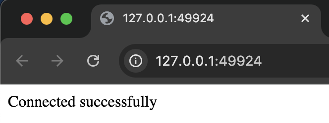

# SPRAWOZDANIE Z LABORATORIUM PROGRAMOWANIE FULL-STACK W CHMURZE OBLICZENIOWEJ

## Kramek Magdalena

## Opis projektu

W poniższym projekcie wykorzystano stacka typu LAMP(Linux, Apache, MySQL, PHP).
W celu wykonania zadania przygotowano własny obraz typu docker image, który został spushowany na repozytorium  `Docker Hub`.
Obraz ten jest na podstawie najnowszego obrazu `php:apache`, dodatkowo zawiera rozszerzenie do obsługi MySQL.
Do obrazu został dołączony także plik `index.php`. 
By uzyskać dostęp, skorzystano z kontrolera `Ingress` oraz polecenie `minikube service lamp`.

## Pliki konfiguracyjne

- **Plik:** `secret.yaml` 
- **Plik:** `stateful.yaml`
- **Plik** `apache-deploy.yaml`
- **Plik:** `network.yaml`
- **Plik:** `ingress.yaml`

## Uruchomienie

Należy uruchomić minikube'a, dodać kontroler `Ingress` oraz wywołać te polecenia:

```bash
kubectl apply -f secret.yaml
kubectl apply -f stateful.yaml
kubectl apply -f apache-deploy.yaml
kubectl apply -f network.yaml
kubectl apply -f ingress.yaml
```
## Potwierdzenie poprawności działania

- Sprawdzenie podów, serwisu oraz Ingressu
```shell
(base) magda@MacBook-Pro-MacBook zad2 % kubectl get pods
NAME                         READY   STATUS    RESTARTS   AGE
apache-pod-875b77996-g9j4h   1/1     Running   0          18m
lamp-mysql-0                 1/1     Running   0          18m
(base) magda@MacBook-Pro-MacBook zad2 % kubectl get svc
NAME         TYPE           CLUSTER-IP      EXTERNAL-IP   PORT(S)          AGE
kubernetes   ClusterIP      10.96.0.1       <none>        443/TCP          96d
lamp         LoadBalancer   10.100.25.117   <pending>     8080:31908/TCP   18m
lamp-mysql   ClusterIP      None            <none>        3306/TCP         18m
(base) magda@MacBook-Pro-MacBook zad2 % kubectl get ingress  
NAME           CLASS    HOSTS        ADDRESS   PORTS   AGE
lamp-ingress   <none>   lamp.local             80      18m
(base) magda@MacBook-Pro-MacBook zad2 % 
```
- Uruchomienie serwisu poleceniem `minikube service lamp`
```
shell
(base) magda@MacBook-Pro-MacBook zad2 % minikube service lamp             
|-----------|------|-------------|---------------------------|
| NAMESPACE | NAME | TARGET PORT |            URL            |
|-----------|------|-------------|---------------------------|
| default   | lamp |        8080 | http://192.168.49.2:31908 |
|-----------|------|-------------|---------------------------|
🏃  Starting tunnel for service lamp.
|-----------|------|-------------|------------------------|
| NAMESPACE | NAME | TARGET PORT |          URL           |
|-----------|------|-------------|------------------------|
| default   | lamp |             | http://127.0.0.1:49727 |
|-----------|------|-------------|------------------------|
🎉  Otwieranie serwisu default/lamp w domyślnej przeglądarce...
❗  Z powodu użycia sterownika dockera na systemie operacyjnym darwin, terminal musi zostać uruchomiony.
```

Wynik:


- Praca podu `apache-pod`
```
shell
(base) magda@MacBook-Pro-MacBook zad2 % kubectl logs apache-pod-875b77996-g9j4h
AH00558: apache2: Could not reliably determine the server's fully qualified domain name, using 10.244.0.23. Set the 'ServerName' directive globally to suppress this message
AH00558: apache2: Could not reliably determine the server's fully qualified domain name, using 10.244.0.23. Set the 'ServerName' directive globally to suppress this message
[Sun Jan 19 19:43:52.808456 2025] [mpm_prefork:notice] [pid 1:tid 1] AH00163: Apache/2.4.62 (Debian) PHP/8.4.3 configured -- resuming normal operations
[Sun Jan 19 19:43:52.808561 2025] [core:notice] [pid 1:tid 1] AH00094: Command line: 'apache2 -D FOREGROUND'
10.244.0.1 - - [19/Jan/2025:19:46:37 +0000] "GET / HTTP/1.1" 200 251 "-" "Mozilla/5.0 (Macintosh; Intel Mac OS X 10_15_7) AppleWebKit/537.36 (KHTML, like Gecko) Chrome/131.0.0.0 Safari/537.36"
10.244.0.1 - - [19/Jan/2025:19:46:38 +0000] "GET /favicon.ico HTTP/1.1" 404 490 "http://127.0.0.1:49727/" "Mozilla/5.0 (Macintosh; Intel Mac OS X 10_15_7) AppleWebKit/537.36 (KHTML, like Gecko) Chrome/131.0.0.0 Safari/537.36"
10.244.0.1 - - [19/Jan/2025:20:06:53 +0000] "GET / HTTP/1.1" 200 251 "-" "Mozilla/5.0 (Macintosh; Intel Mac OS X 10_15_7) AppleWebKit/537.36 (KHTML, like Gecko) Chrome/131.0.0.0 Safari/537.36"
10.244.0.1 - - [19/Jan/2025:20:06:53 +0000] "GET /favicon.ico HTTP/1.1" 404 490 "http://127.0.0.1:49888/" "Mozilla/5.0 (Macintosh; Intel Mac OS X 10_15_7) AppleWebKit/537.36 (KHTML, like Gecko) Chrome/131.0.0.0 Safari/537.36"
(base) magda@MacBook-Pro-MacBook zad2 % 
```
